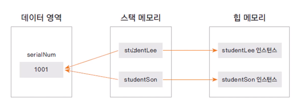

인스턴스 
    클래스로 부터 생성된 객체 
    힙 메모리에 멤버 변수의 크기에 따라 메모리가 생성 
    클래스를 기반으로 new 키워드를 이용하여 여러 개의 인스턴스를 생성 

class는 stack 인스턴스는 heap 메모리에 저장 

자바는 가비지 콜렉터가 thread가 있어 heap에 있는 쓰지 않는 메모리를 수거 
클래스가 메모리에 생성된 상태 

참조 변수 : 메모리에 생성된 인스턴스를 가리키는 변수 
참조 값 : 생성된 인스턴스의 메모리 주소 값 

생성자 
    객체를 생성할 때 new 키워드와 함께 호출 
    인스턴스를 초기화 하는 코드가 구현
    반환값이 없음, 상속 x
    생성자는 클래스이름과 동일 

기본 생성자 
    하나의 클래스는 반드시 하나 이상의 생성자가 존재해야함 

오버로딩 
    생성자를 두 개 이상 구현하는 경우 
    사용하는 코드에 따라서 선택하여 사용 가능하다. 
    private변수도 생성자를 통해서 구현 가능 

참조 자료형 
    변수의 자료형 
        기본 자료형 
            : int, long, float, double 등 
        참조 자료형 
            : String, Date, Student 

클래스형으로 변수를 선언함 
    String 

접근 제어자 
    변수, 메서드, 생성자에 대한 접근 권한 지정
    public, private, protected, 아무것도 안쓰는 경우(default 기본접근제어자) 같은 클래스에서만 접근 가능 
    private을 사용하면 클래스 외부에서는 접근 할 수 없음 

정보 은닉 
    외부에서 클래스 내부의 정보에 접근하지 못하도록 함 
    private 키워드를 활용 

    private변수를 외부에서 접근하게 하려면 public 메서드를 제공함 
    클래스 내부 데이터를 잘못 사용하는 오류를 방지할 수 있음 

함수 호출이 일어나면서 stack 메모리가 생성이 되고 이를 반환하게 된다. 
함수에서 일어나는(호출하는) 메모리를 stack 이라 부른다. 
함수의 수행이 끝나게 되면 자동적으로 반환된다. 

class는 stack, 인스턴스는 heap 

class는 stack에 쌓여 있고 인스턴스는 stack의 있는 class 메모리를 참조하여
heap 인스턴스 메모리를 생성한다. 

인스턴스 
    클래스로부터 생성된 객체 
    힙 메모리에 멤버 변수의 크기에 따라 메모리가 생성 
    클래스를 기반으로 new 키워드를 이용하여 여러개의 인스턴스를 생성 

$$ 
맴버 변수들은 Heap 메모리 안에 인스턴스가 생성되었을때 
있고 이는 stack 메모리에서 Heap 메모리로 생성된 것이다. 
$$ 

stack에는 참조 변수가 생성되게 되고 new를 선언했을 때 참조 값이 생성되게 된다. 
참조 값을 참조 변수가 받게되면 이를 가지고 객체를 처리하게된다. 참조값으로 작업하면 내부에서 연결된 메모리로 작업하는 것과 같은 효과 이다.

즉 Parent A = null 이란 것은 참조변수 A가 참조값이 아직 없다는 것이고, 실제 객체가 없다는 것을 의미한다. 만약

- Parent A = new Parent()
- Parent B = A

라면 B와 A 는 같은 참조값을 사용하기 때문에 서로 같은 객체를 사용하게 된다.
이는 자바가 Call By Value 즉 값에 의한 호출만 존재하기 때문이다.

- MotorCycle: 새로운 사용자 정의 데이터 타입
- m: MotorCycle 데이터 타입으로 선언한 참조변수(객체변수)
- new: 메모리를 생성하는 연산자, 참조값을 리턴합니다.
- MotorCycle(): 메모리 생성 후 해당 메모리의 초기화 작업을 담당하는 생성자
- MotorCycle m = new MotorCycle();

call-by-value (값에 의한 호출)

- 함수가 호출될 때, 메모리 공간 안에서는 함수를 위한 별도의 임시 공간이 생성된다. (c++의 경우 stack frame) 함수가 종료되면 해당 공간은 사라진다.
- 스택 프레임(Stack Frame) : 함수 호출시 할당되는 메모리 블록(지역변수의 선언으로 인해 할당되는 메모리 블록)
- call-by-value 값에 의한 호출방식은 함수 호출시 전달되는 변수의 값을 복사하여 함수의 인자로 전달한다.
- 복사된 인자는 함수 안에서 지역적으로 사용되는 local value의 특성을 가진다.
- 따라서 함수 안에서 인자의 값이 변경되어도, 외부의 변수의 값은 변경되지 않는다.
- Java의 경우 함수에 전달되는 인자의 데이터 타입에 따라서 (원시자료형 / 참조자료형) 함수 호출 방식이 달라진다.
    원시 자료형 (primitive type) : call-by-value 로 동작 (int, short, long, float, double, char, boolean )
    참조 자료형 (reference type): call-by-reference 로 동작 (Array, Class Instance)

call-by-reference (참조에 의한 호출)
- 함수가 호출될 때, 메모리 공간 안에서는 함수를 위한 별도의 임시 공간이 생성된다. (예: stack frame) 함수가 종료되면 해당 공간은 사라진다.
- call-by-reference 참조에 의한 호출방식은 함수 호출시 인자로 전달되는 변수의 레퍼런스를 전달한다. (해당 변수를 가르킨다.)
`따라서 함수 안에서 인자의 값이 변경되면, 아규먼트로 전달된 객체의 값도 함께 변경된다.

생성자 (constructor)
객체를 생성할때 new 키워드와 함께 호출 (객체 생성 외에는 호출할 수 없음)
인스터스를 초기화 하는 코드가 구현됨 (주로 멤버 변수 초기화)
상속되지 않음
생성자는 클래스이름과 동일 

기본생성자 (default constructor)
하나의 클래스에는 반드시 하나 이상의 생성자가 존재해야함 
프로그래머가 생성자를 구현하지 않으면 컴파일러가 생성자 코드를 넣어줌 

=> 기본 생성자

기본생성자는 매개변수가 없고, 구현부가 없음

this의 역할

- 자신의 메모리를 가리킴
- 생성자에서 다른 생성자를 호출함
- 인스턴스 자신의 주소를 반환
  
생성자에서 다른 생성자를 호출

    public Person(){
        this("이름없음", 1);
    }
    public Person(String name, int age){
        this.name = name;
        this.age  = age;
    }

static 변수
여러 인스턴스가 하나의 값을 공유할 필요가 있음
static 변수는 처음 프로그램이 로드 될 때 데이터 영역에 생성됨
인스턴스의 생성과 상관없이 사용할 수 있으므로 클래스 이름으로 참조
Studnet.serialNum = 100;
클래스 변수, 정적변수라고도 함
예를 들어 학생이 생성될때 마다 새로운 번호를 생성하게끔하고 싶을때 이를 기준으로 삼을 수 있는 변수를 static으로 무두가 바라볼 수 있게 만들 수 있다.
스태틱 (데이터 영역)은 <-> 스택메모리 <-> 힙 메모리 

static 메서드 에서는
    지역변수를 사용해도 된다.
    static 변수를 사용해도 된다.
    인스턴스 변수를 사용해서는 안된다.  왜냐면 static 메서드는 인스턴스가 선언되지 않아도 사용 될 수 있기 때문에 static 메서드안에는 인스턴스 변수를 사용해서는 안된다.

지역변수 
    함수 내부에 선언 메모리 스택, 함수가 호출될때 생성되고 끝나면 소멸
멤버 변수 
    클래스 멤버 변수로 선언 클래스 내부에서 사용하고 private이 아니면 참조 변수로 다른 클래스에서 사용가능 메모리 힙 인스턴스가 생성될때 힙에 생성되고, 가비지 컬렉터가 메모리를 수거할 때 소멸됨
static 변수
    static 예약어를 사용하여 클래스 내부에 선언
    클래스 내부에서 사용하고 private이 아니면 클래스 이름으로 다른 클래스에서 사용가능
    메모리 데이터 영역 
    프로그램이 처음 시작할 때 상수와 함계 데이터 영역에 생성되고 프로그램이 끝나고 메모리를 해제할 때 소멸됨 

배열 선언하기 
    int[] arr   = new int[10];
    int arr[]   = new int[10];

물리적 위치와 논리적 위치가 일치함 

ArrayList 클래스

자바에서 제공되는 객체 배열이 구현된 클래스 
요소 추가 add( E e);

상속하는 클래스 : 상위 클래스, parent class, base class, super class
상속받는 클래스 : 하위 클래스, child class, derived class, subclass 

class B extends A 

extends는 단하나만 가능 

하위 클래스 생성되는 과정
하위클래스가 생성될 대 상위 클래스가 먼저 생성됨 
하위 클래스의 생성자에서는 무조건 상위 클래스의 생성자가 호출되어야함 
하위클래스에서 상위 클래스의 생성자를 호출하는 코드가 없는 경우 컴파일러는 상위 클래스 기본 생성자를 호출하기 위한 super() 를 추가함
super() 로 호출되는 생성자느 상위 클래스의 기본생성자임
만약 상위 클래스의 기본생성자가 없는 경우 (매개변수가 있는 생성자만 존재하는 경우 ) 하위 클래스는 명시적으로 상위클래스의 생성자를 호출해야함 

상송에서 메모리 상태
상위 클래스의 인스턴스가 먼저 생성이 되고, 하위 클래스의 인스턴스가 생성됨 

상위 클래스로의 묵시적 형 변환 (업캐스팅)
단 이런 경우 상위 클래스에서 정의된 내용만 사용가능 

overloading 같은 이름이지만 매개변수가 다름
override 같은 이름과 매개변수이지만 내부 메서드를 수정한다. 

@FuctionalInterface 재정의된 메서드라는 정보 제공
@Deprecated 이후 버전에서 사용되지 않을 수 있는 변수, 메서드에 사용됨
@SuppressWarnings 특정 경고가 나타나지 않도록 함 
                @SuppressWarnings("deprecation")는 @Deprecated가 나타나지 않도록함 

자바에서는 항상 인스턴스의 메서드가 호출 

가상메서드

메서드의 이름과 메서드 주소를 가진 가상 메서드 테이블에서 호출될 메서드의 주소를 참조함 

즉 함수를 하위 클래스에서 재정의한 경우 가상 함수가 새로생성되서 추후 참조시 사용된다. 
